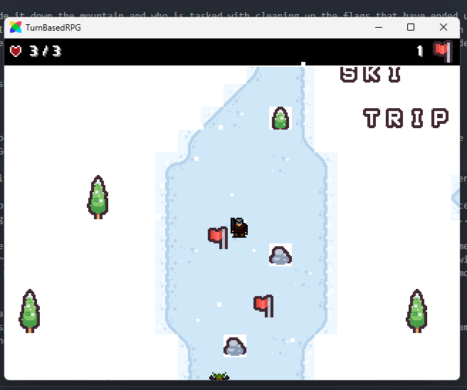
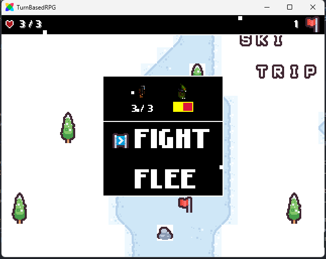
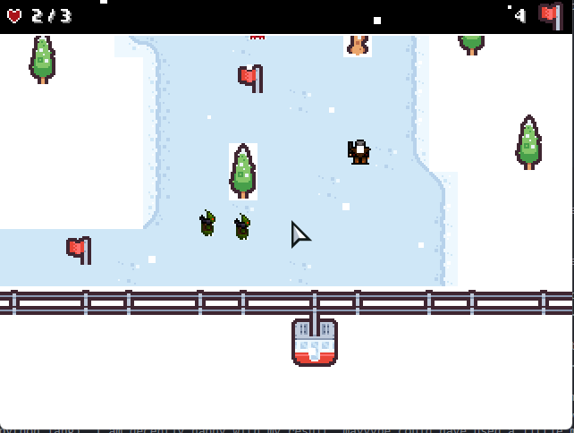

# this is snowdog, a simple RPG made in haxe to learn haxe.
#### Made for the YSWS Dummies V2 (Hack Club)
[https://hackatime-badge.hackclub.com/U09GRHV7Y80/TurnBasedRPG]() + [https://hackatime-badge.hackclub.com/U09GRHV7Y80/snowdog]()
### Controls:
Arrow Keys for movement
Enter for selection

### Goal:
You're a skiier who's made it down the mountain and who is tasked with cleaning up the flags that have ended up at the bottom of the hill (damnned skiiers ripping out the flags). In the time you've been gone though, a rather agresive group of protesters have shown up to protest your use of fossil fuels for lifts? The story's not really clear, but you need the flags, and to get to the ski lift, which is being guarded by the protest leader. Kill him, and claim your victory.

of course you want screnshots though, because look at you not wanting to play the game.

### How can I play this PEAK game?
WELL, there's a couple of options.
You can play it over on [itch.io](https://bouncyblock.itch.io/), or you could just grab a release from the Releases tab, or if you're insane, you can build from source.

IF YOU ARE BUILDING FROM SOURCE, make sure you have the following installed with haxe:
flixel
flixel-addons

I have not yet compiled for HTML5 because I don't know what this screen wants from me: 

I'd also recommend compiling it with Lime as that's what I used for testing the game.

### Production Details:
I decided to learn Haxe because I'd heard of it as a library-based game engine, and I haven't really used one of those to create a full game before, usually sticking with PICO-8 or Godot. Haxe was used to make Dead Cells, so I decided to give it a shot.

I used a major library with Haxe called Haxeflixel which managed a lot of the heavy lifting for me, as I understand, but that didn't fully save me.

Between the weird FOR loop formatting (i in 1...25)????? and the ability to randomly switch between whitespace and brackets like C#, everything was just so off-putting that throwing in classes as well felt like a blow to the chest (only ever used OOP for Playdate...)

The assets this time around aren't my finest work, but by the end of this project, I was ready to be DONE with haxeflixel. And tbh, the style of boxes kind of fits haxeflixel. I'm not an artist though, so I really can't be complaining it came out somewhat cohisive...

In general, I didn't like using Haxe, which is why I left many of the features I wanted to add out of the game. I do intend on making a platformer, but learning a physics library in an engine like this was going to require months of learning, and research. (i will probably return to haxe at some point, but I need a break from a C# + python lang). I am decently happy with my result, mayyybe could have used a little more sound effects but all the main mechanics work which I'm proud of.

Haxe as a language gets a 6/10, I'm sticking with my good ol Lua.
HaxeFlixel gets 5/10, despite being a good library that does things for you, the whole idea of not using a game engine for managing some of these things felt like it was excesive. I needed 500 lines for COMBAT HUD, not something I want to do again.

### Assets used:
[Tiny Ski](https://kenney-assets.itch.io/tiny-ski)
[Cozy Tunes](https://pizzadoggy.itch.io/cozy-tunes)
